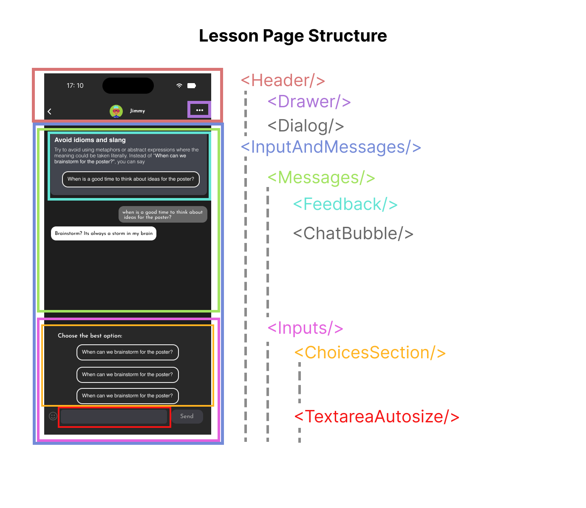

# Installation & Development

``` sh
npm install
npm start
```

# Component Hierarchy
Lesson page and playground page are very similar with slight differences.



The Dialog component shows the Scenario and Goal for the lesson page.


# Routing

Controlled by App.js, there are currently these routes:

``` js
<Routes>
    <Route path={`/:magicLink`} element={<Landing />} />
    <Route path={`/`} element={<Landing />} />
    <Route
        path="/lesson/:lesson/:conversationIDFromParam?"
        element={<Lesson />}
    />
    <Route path="/playground" element={<Playground />} />
    <Route
        path="/playground/:conversationIDFromParam"
        element={<Playground />}
    />
</Routes>
```

# API calls

All API calls are wrapped in functions organized by its request type in 
utils/request.js. If the call is successful, it will return { ok, data }, 
wherein ok is a boolean for whether the call was successful, and data is the 
returned value. If the call is unsuccessful, it will return { ok, error }, where 
error will be the caught error or "Unknown error".

The series of calls made after clicking the Send button is stored in
/src/components/InputSection/util/handleSend.js.


